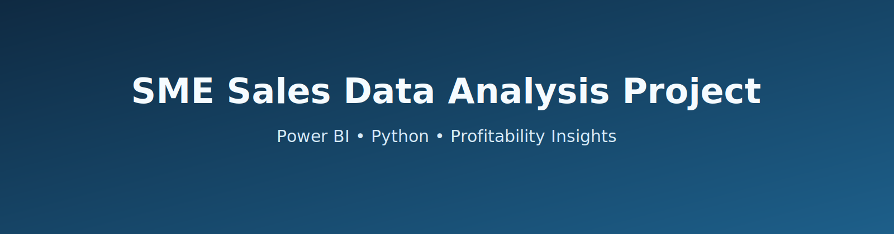
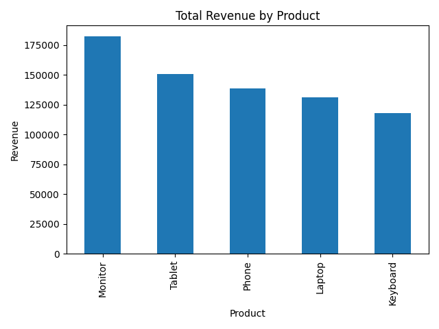
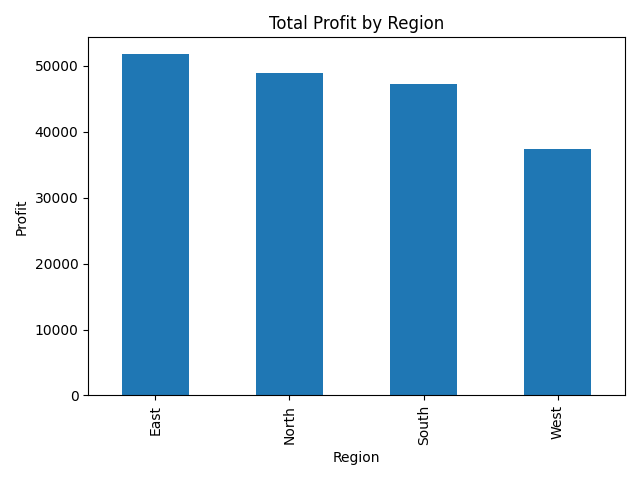
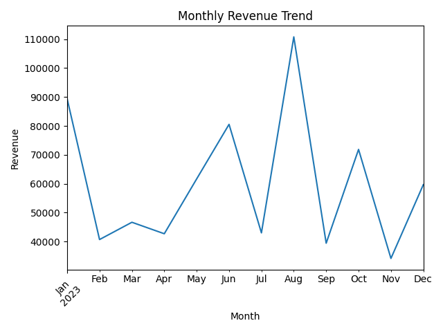

  

# 📊 SME Sales Data Analysis Project 

This project presents an end-to-end data analysis workflow using a simulated retail sales dataset. It demonstrates data cleaning, feature engineering, and financial performance analysis using transactional sales data.

The objective of this project is to:

- Analyze product-level performance
- Evaluate regional sales trends
- Calculate revenue, cost, and profit metrics
- Perform exploratory data analysis (EDA)
- Prepare structured datasets for visualization and business insights

The repository includes both the raw dataset and a cleaned version with engineered financial features (Revenue, Cost, Profit), making it suitable for analytical modeling, dashboard creation, and reporting.

This project is designed to showcase practical data analysis skills, structured project organization, and clean dataset preparation for real-world business scenarios.

## 🛠️ Tech Stack

- Python
- Pandas
- NumPy
- Matplotlib
- Jupyter Notebook
- Git & GitHub

---

# SME Sales Profitability Dashboard

A professional data analytics portfolio project focused on understanding sales performance and profitability patterns for Small and Medium Enterprises (SMEs) using **Power BI** and **Python**.

---

## Project Overview

This project is designed to analyze SME sales data, transform it into actionable insights, and present business performance through interactive dashboards and data storytelling.

The workflow includes:
- Collecting raw sales data
- Cleaning and transforming data using Python
- Engineering profitability metrics (cost, profit, margin)
- Building dashboards in Power BI for executive reporting

---

## KPIs

The project tracks key business indicators including:
- **Total Sales Revenue**
- **Total Cost**
- **Total Profit**
- **Average Profit Margin (%)**
- **Top Performing Products / Categories**
- **Regional Sales & Profitability Trends**
- **Monthly Sales Growth**

---

## Tools Used

- **Python** (Pandas, NumPy, Matplotlib, Seaborn) for data cleaning and analysis
- **Jupyter Notebook** for exploratory analysis and reproducible workflows
- **Power BI** for interactive dashboards and KPI visualization
- **Git & GitHub** for version control and portfolio presentation

---

## Dataset Description

The dataset contains transactional SME sales records. Typical fields include:
- Order/Transaction Date
- Product or Category
- Quantity Sold
- Unit Price
- Sales Amount
- Region / Customer Segment

During processing, additional profitability fields are generated:
- `cost`
- `profit`
- `profit_margin`

---

## Business Value

This project helps stakeholders:
- Identify high-margin products and underperforming segments
- Understand profitability drivers across regions and time
- Make data-driven pricing and inventory decisions
- Monitor business health with clear KPI dashboards

---

## Future Enhancements

Planned improvements include:
- Automated ETL pipeline for recurring data refresh
- Forecasting models for future sales and profit trends
- Customer segmentation using clustering
- Advanced Power BI drill-through and scenario analysis
- Deployment of insights through a lightweight web app

---

## 📊 Sample Visualizations

### Revenue by Product

  

### Profit by Region

  

### Monthly Revenue Trend

  

---

## 📈 KPI Summary

Based on the cleaned dataset analysis:

- 💰 **Total Revenue:** Sum of all order revenues across 2023.
- 📊 **Total Profit:** Net profit generated after deducting total costs.
- 🧾 **Average Order Value (AOV):** Average revenue generated per order.
- 📦 **Total Orders:** 200 transactions analyzed.
- 🌍 **Regions Covered:** 4 sales regions (North, South, East, West).
- 🛍️ **Product Categories:** 5 product types.

These KPIs provide a high-level performance overview of the retail sales operations and serve as key business performance indicators.

---

## 🎯 Business Recommendations

Based on the data analysis:

1. 📌 **Focus on High-Margin Products**
   - Identify products generating strong profit margins and prioritize marketing efforts for these items.

2. 📌 **Optimize Regional Strategy**
   - Regions with lower profitability may require pricing adjustments, promotional campaigns, or cost optimization strategies.

3. 📌 **Leverage Peak Sales Periods**
   - Increase inventory and marketing investment during high-revenue months to maximize seasonal gains.

4. 📌 **Improve Margin Monitoring**
   - High revenue does not always equal high profit. Regular margin analysis should guide pricing and discount decisions.

5. 📌 **Data-Driven Decision Making**
   - Implement dashboards and automated KPI tracking to continuously monitor business performance.

---

## Author

**Gazi Shoaib**

If you found this project useful, feel free to connect and share feedback.
